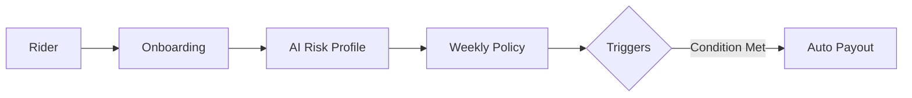

# Rider Shield

## 🎯 Problem & Persona
- **Persona**: Swiggy rider in Chennai earning ₹800-1200/day.
- **Problem**: Riders lose ₹200-400/day during severe weather conditions like heavy rain and high pollution, leading to a 20-30% drop in weekly earnings.
- **Solution**: A weekly premium parametric insurance model starting at a ₹49 base, dynamically AI-adjusted ±20% based on real-time location risk.

## 🏗️ Solution Architecture

- **Platform**: Responsive Web App deployed on Vercel.
- **Tech Stack**: Next.js, Tailwind CSS, TypeScript.

## 🚀 Core Features (Phase 1 MVP)
- Rider onboarding + risk profiling
- Dynamic weekly premium calculator
- 3 parametric triggers: Rain (>20mm/hr), Heat (>40°C), Pollution (AQI>300)
- Mock auto-claim + payout simulation
- Basic fraud detection (duplicate claims)

## 🤖 AI/ML Integration
- **Premium pricing:** ML model predicts location risk (low/medium/high) to natively adjust the weekly premium.
- **Fraud detection:** GPS anomaly tracking coupled with claim pattern analysis.
- **Future goals:** Weather prediction for proactive coverage.

## 💰 Weekly Pricing Model
- **Base Premium:** ₹49/week (covers 40 hours income protection)
- **AI Adjustment:** ±20% based on Chennai zone flood history
- **Examples:** 
  - Anna Nagar (low risk) = ₹39
  - Marina Beach (high risk) = ₹59

## 📊 Parametric Triggers

| Trigger | Threshold | Data Source | Payout |
|---------|-----------|-------------|--------|
| Heavy Rain | >20mm/hr | OpenWeatherMap | 4hrs wage |
| Extreme Heat | >40°C | Weather API | 6hrs wage |
| Severe Pollution | AQI>300 | Mock API | 3hrs wage |
